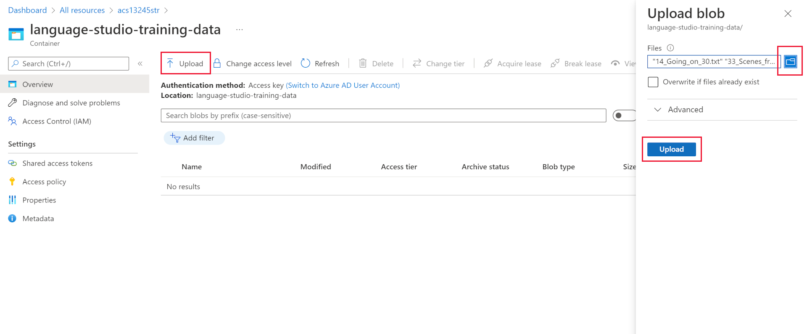
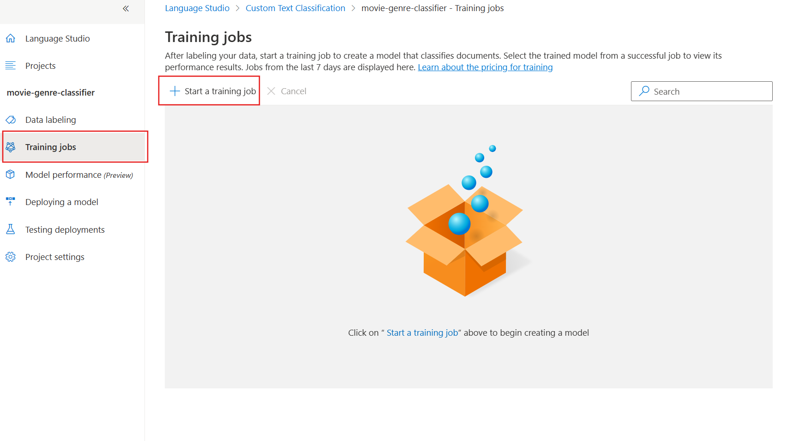
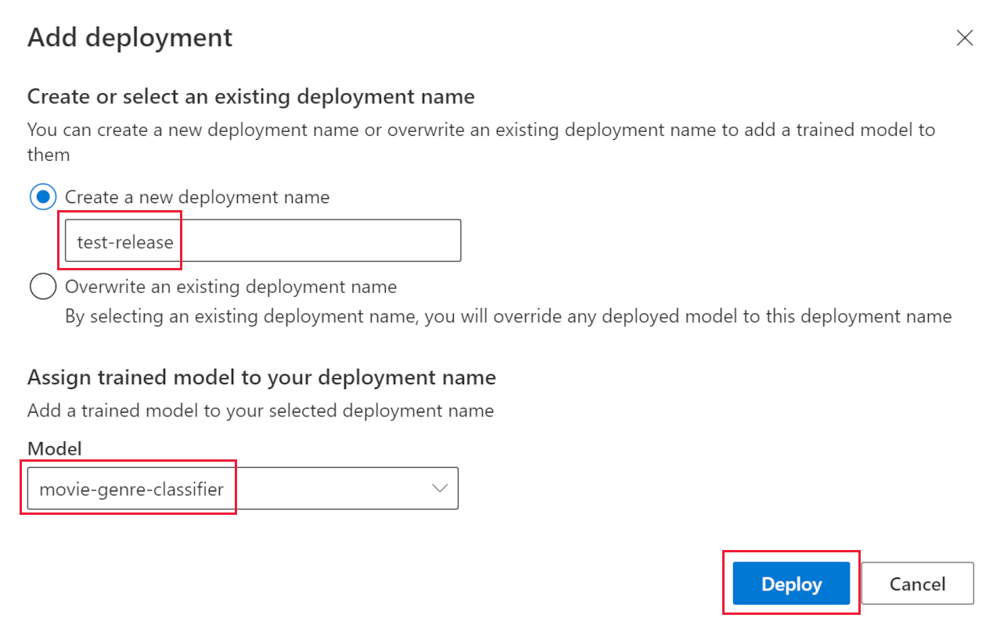

---
lab:
    title: 'Enrich an AI search index with custom classes'
---

# Enrich an AI search index with custom classes

You've built a search solution and now want to add Azure AI Services for language enrichments to your indexes.

In this exercise, you'll create an Azure AI Search solution and enrich an index with the results from a Language Studio custom text classification project. You'll create a function app to connect search and your classification model together.

> **Note**
> To complete this exercise, you will need a Microsoft Azure subscription. If you don't already have one, you can sign up for a free trial at [https://azure.com/free](https://azure.com/free?azure-portal=true).

## Set up your development environment with Python, VS Code and VS Code Extensions

Install these tools to complete this exercise. You can still follow along with the steps without these tools.

1. Install [VS Code](https://code.visualstudio.com/)
1. Install [Azure Core Functions Tool](https://github.com/Azure/azure-functions-core-tools)
1. Install [Azure Tools Extensions for VS Code](https://code.visualstudio.com/docs/azure/extensions)
1. Install [Python 3.8](https://www.python.org/downloads/release/python-380/) for your operating system.
1. Install [Python Extension for VS Code](https://marketplace.visualstudio.com/items?itemName=ms-python.python)

## Set up your Azure resources

To save you time, select this Azure ARM template to create resources you'll need later in the exercise.

### Deploy a pre-built ARM template

1. [](https://portal.azure.com/#create/Microsoft.Template/uri/https%3A%2F%2Fraw.githubusercontent.com%2FMicrosoftLearning%2Fmslearn-knowledge-mining%2Fmain%2FLabfiles%2F04-enrich-custom-classes%2Fazuredeploy.json) select this link to create your starting resources. You might need to copy and paste the [direct link](https://portal.azure.com/#create/Microsoft.Template/uri/https%3A%2F%2Fraw.githubusercontent.com%2FMicrosoftLearning%2Fmslearn-knowledge-mining%2Fmain%2FLabfiles%2F04-enrich-custom-classes%2Fazuredeploy.json) into your search bar.

    
1. In **Resource group**, select **Create new**, name it **cog-search-language-exe**.
1. In **Region**, select a [supported region](https://learn.microsoft.com/azure/ai-services/language-service/concepts/regional-support) that is close to you.
1. The **Resource Prefix** needs to be globally unique, enter a random numeric and lower-case character prefix, for example **acs18245**.
1. In **Location**, select the same region you chose above.
1. Select **Review + create**.
1. Select **Create**.

    > **Note**
    > There's an error shown, **You will need to Agree to the terms of service below to create this resource successfully.**, by selecting **Create** you are agreeing to them.

1. Select **Go to resource group** to see all the resources that you've created.

    
You'll be setting up an Azure Cognitive Search index, creating an Azure function, and creating a Language Studio project to identify movie genres from their summaries.

### Upload sample data to train language services

This exercise uses 210 text files that contain a plot summary for a movie. The text files name is the movie title. The folder also contains a **movieLabels.json** file that maps the genres of a movie to the file, for each file there's a JSON entry like this:

```json
{
    "location": "And_Justice_for_All.txt",
    "language": "en-us",
    "classifiers": [
        {
            "classifierName": "Mystery"
        },
        {
            "classifierName": "Drama"
        },
        {
            "classifierName": "Thriller"
        },
        {
            "classifierName": "Comedy"
        }
    ]
},
```

1. Navigate to **Labfiles/04-enrich-custom-classes** and extract the **movies summary.zip** folder containing all the files.

    > **Note**
    > You use these files to train a model in Language Studio, and will also index all the files in Azure AI Search.

1. In the [Azure portal](https://portal.azure.com/), select **Resource groups**, then select your resource group.
1. Select the storage account you created, for example **acs18245str**.
1. Select **Configuration** from the left pane, select the **Enable** option for the *Allow Blob anonymous access* setting and then select **Save** at the top of the page.

    

1. Select **Containers** from the left, then select **+ Container**.
1. In the **New container** pane, in **Name**, enter **language-studio-training-data**.
1. In **Anonymous access level**, choose **Container (anonymous read access for containers and blobs)** and select **Create**.
1. Select the new container you just created, **language-studio-training-data**.
    
1. Select **Upload** at the top of the pane.
1. In the **Upload blob** pane, select **Browse for files**.
1. Navigate to where you extracted the sample files, select all the text (`.txt`) and json (`.json`) files.
1. Select **Upload** in the pane.
1. Close the **Upload blob** pane.

### Create a language resource

1. In the breadcrumb link at the top of the page, select **Home**.
1. Select **+ Create a resource** and search for *Language service*.
1. Select **Create** under **Language Service**.
1. Select the option that includes **Custom text classification and Custom named entity recognition**.
1. Select **Continue to create your resource**.
1. In **Resource group**, choose **cog-search-language-exe**.
1. In **Region**, select the region you used above.
1. In **Name**, enter **learn-language-service-for-custom-text**. This needs to be unique globally, so you might need to add a random numbers or characters at the end of it.
1. In **Pricing tier**, select **S**.
1. In **New/Existing storage account**, select **Existing storage account**.
1. In **Storage account in current selected subscription and resource region**, select the storage account you created, for example **acs18245str**.
1. Agree to the **Responsible AI Notice** terms, then select **Review + create**.
1. Select **Create**.
1. Wait for the resources to be deployed, then select **Go to resource group**.
1. Select **learn-language-service-for-custom-text**.

    
1. Scroll down on the **Overview** pane, and select **Get started with Language Studio**.
1. Sign in the language studio. If you are prompted to choose a Language resource select the resource you created earlier.

### Create a custom text classification project in Language Studio

1. On the Language Studio home page, select **Create new**, then select **Custom text classification**.

    

1. Select **Next**.

    
1. Select **Multi label classification**, then select **Next**.

    

1. In **Name**, enter **movie-genre-classifier**.
1. In **Text primary language**, select **English (US)**.
1. In **Description**, enter **A model that can identify a movie genre from the summary**.
1. Select **Yes, enable multi-lingual dataset**.
1. Select **Next**.

    

1. In **Blob storage container**, choose **language-studio-training-data**.
1. Select **Yes, my documents are already labeled and I have a correctly formatted JSON labels file**.
1. In **Label documents**, choose **movieLabels**.
1. Select **Next**.
1. Select **Create project**.

### Train your custom text classification AI model

1. On the left, select **Training jobs**.

    

1. Select **+ Start a training job**.

    
1. In **Train a new modal**, enter **movie-genre-classifier**.
1. Select **Train**.
1. Training the classifier model should take less than 10 minutes. Wait for the status to change to **Training succeeded**.

### Deploy your custom text classification AI model

1. On the left, select **Deploying a model**.

    
1. Select **Add a deployment**.

    
1. In **Create a new deployment name**, enter **test-release**.
1. In **Model**, select **movie-genre-classifier**.
1. Select **Deploy**.

Leave this web page open for later in this exercise.

### Create an Azure AI Search index

Create a search index that you can enrich with this model, you'll index all the text files that contain the movie summaries you've already downloaded.

1. In the [Azure portal](https://portal.azure.com/), select **Resource groups**, select your resource group, then select the storage account you created, for example **acs18245str**.
1. Select **Containers** from the left, then select **+ Container**.
1. In the **New container** pane, in **Name**, enter **search-data**.
1. In **Anonymous access level**, choose **Container**.
1. Select **Create**.
1. Select the new container you just created, **search-data**.
1. Select **Upload** at the top of the pane.
1. In the **Upload blob** pane, select **Browse for files**.
1. Navigate to where you downloaded the sample files, select **ONLY** the text (`.txt`) files.
1. Select **Upload** in the pane.
1. Close the **Upload blob** pane.

### Import documents into Azure AI Search

1. On the left, select **Resource groups**, select your resource group, then select your search service.

1. Select **Import data**.

    
1. In **Data Source**, select **Azure Blob Storage**.
1. In **Data source name**, enter **movie-summaries**.
1. Select **Choose an existing connection**, select your storage account, then select the container you just created, **search-data**.
1. Select **Add cognitive skills (optional)**.
1. Expand the **Attach AI Services** section, then select the Azure AI service you created earlier.

    
1. Expand the **Add enrichments** section.

    
1. Leave all the fields with their default values, then select **Extract people names**.
1. Select **Extract key phrases**.
1. Select **Detect language**.
1. Select **Next: Customize target index**.

    
1. Leave all the fields with their default values, for **metadata_storage_name** select **Retrievable** and **Searchable**.
1. Select **Next: Create an indexer**.
1. Select **Submit**.

The indexer will run and create an index of the 210 text files. You don't need to wait for it to continue with the next steps.

## Create a function app to enrich your search index

You'll now create a Python function app that your cognitive search custom skillset will call. The function app will use your custom text classifier model to enrich your search index.

1. [Download required files](https://github.com/MicrosoftLearning/mslearn-knowledge-mining/raw/main/Labfiles/04-enrich-custom-classes/movie-genre-function.zip) and extract the folder containing all the files.
1. Open Visual Studio Code, open the **movie-genre-function** folder you've just downloaded.

    
1. If you've installed all the required extensions, you're prompted to optimize the project. Select **Yes**.
    
1. Select your Python interpreter, it should be version 3.8.
1. The workspace will be updated, if you're asked to connect it to the workspace folder, select **Yes**.
1. Press **F5** to debug the app.

    
    If the app is running you should see a localhost URL that you can use for local testing.

1. Stop debugging the app, press **SHIFT** + **F5**.

### Deploy your local function app to Azure

1. In Visual Studio Code, press **F1** to open the command palette.
1. In the command palette, search for and select `Azure Functions: Create Function App in Azure...`.
1. Enter a globally unique name for your function app, for example **acs13245str-function-app**.
1. In **Select a runtime stack**, select **Python 3.8**.
1. Select the same location you used above.

1. In the left navigation, select the **Azure** extension.
    
1. Expand **Resources**, expand **Function App** under your subscription, then right-click on the function, for example **acs13245-function-app**.
1. Select **Deploy to Function App**. Wait for the app to be deployed.
1. Expand the app, right-click on **Application Settings**, select **Download Remote Settings**.
1. On the left, select **Explorer**, then select **local.settings.json**.

    
The function app needs to be connected to your custom text classification model. Follow these steps to get the configuration settings.

1. In your browser, navigate to **Language Studio**, you should be on the **Deploying a model** page.

    
1. Select your model. Then select **Get prediction URL**.
1. Select the copy icon next to the **Prediction URL**.
1. In Visual Studio Code, at the bottom of **local.settings.json**, paste the prediction URL.
1. In **Language Studio**, on the left, select **Project settings**.

    
1. Select the copy icon next to the **Primary key**.
1. In Visual Studio Code, at the bottom of **local.settings.json**, paste the primary key.
1. Edit the settings to add these four lines at the bottom, copy the endpoint into the `TA_ENDPOINT` value.

    ```json
    ,
    "TA_ENDPOINT": " [your endpoint] ",
    "TA_KEY": " [your key] ",
    "DEPLOYMENT": "test-release",
    "PROJECT_NAME": "movie-genre-classifier"
    ```

1. Copy the primary key into the `TA_KEY` value.

    ```json
    {
      "IsEncrypted": false,
      "Values": {
        "AzureWebJobsStorage": "DefaultEndpointsProtocol=https;AccountName=...",
        "FUNCTIONS_EXTENSION_VERSION": "~4",
        "FUNCTIONS_WORKER_RUNTIME": "python",
        "WEBSITE_CONTENTAZUREFILECONNECTIONSTRING": "DefaultEndpointsProtocol=https;AccountName=...",
        "WEBSITE_CONTENTSHARE": "acs...",
        "APPINSIGHTS_INSTRUMENTATIONKEY": "6846...",
        "TA_ENDPOINT": "https://learn-languages-service-for-custom-text.cognitiveservices.azure.com/language/analyze-text/jobs?api-version=2022-05-01",
        "TA_KEY": "7105e938ce1...",
        "DEPLOYMENT": "test-release",
        "PROJECT_NAME": "movie-genre-classifier"
      }
    }

    ```

    The settings should look like above, with the values of your project.
 
1. Press **CTRL**+**S** to save your **local.settings.json** changes.
1. In the left navigation, select the **Azure** extension.
1. Expand **Resources**, and under your subscription, expand **Function App**, then right-click on **Application Settings**, select **Upload Local Settings**.

### Test your remote function app

There's a sample query you can use to test that your function app and classifier model are working correctly.

1. On the left, select **Explorer**, expand the **customtextcla** folder, then select **sample.dat**.

    
1. Copy the contents of the file.
1. On the left, select the **Azure** extension.

    
1. Under the **Function App**, expand **Functions**, right-click on **customtextcla**, then select **Execute Function now**.
1. In **Enter request body**, paste the sample data you copied, then press **Enter**.

    The function app will respond with JSON results.

1. Expand the notification to see the whole results.

    
    The JSON response should look like this:

    ```json
    {"values": 
        [
            {"recordId": "0", 
            "data": {"text": 
            [
                {"category": "Action", "confidenceScore": 0.99}, 
                {"category": "Comedy", "confidenceScore": 0.96}
            ]}}
        ]
    }
    ```

### Add a field to your search index

You need a place to store the enrichment returned by your new function app. Follow these steps to add a new compound field to store the text classification and confidence score.

1. In the [Azure portal](https://portal.azure.com/), go to the resource group that contains your search service, then select the cognitive search service you created, for example **acs18245-search-service**.
1. On the **Overview** pane, select **Indexes**.
1. Select **azurebob-index**.
1. Select **Edit JSON**.
1. Add the new fields to the index, paste the JSON below the content field.

    ```json
    {
      "name": "textclass",
      "type": "Collection(Edm.ComplexType)",
      "analyzer": null,
      "synonymMaps": [],
      "fields": [
        {
          "name": "category",
          "type": "Edm.String",
          "facetable": true,
          "filterable": true,
          "key": false,
          "retrievable": true,
          "searchable": true,
          "sortable": false,
          "analyzer": "standard.lucene",
          "indexAnalyzer": null,
          "searchAnalyzer": null,
          "synonymMaps": [],
          "fields": []
        },
        {
          "name": "confidenceScore",
          "type": "Edm.Double",
          "facetable": true,
          "filterable": true,
          "retrievable": true,
          "sortable": false,
          "analyzer": null,
          "indexAnalyzer": null,
          "searchAnalyzer": null,
          "synonymMaps": [],
          "fields": []
        }
      ]
    },
    ```

    Your index should now look like this.

    
1. Select **Save**.

### Edit the custom skillset to call your function app

The cognitive search index needs a way to have these new fields populated. Edit the skillset you created earlier to call your function app.

1. At the top of the page, select the search service link, for example **acs18245-search-service | Indexes**.

1. On the **Overview** pane, select **Skillsets**.

    
1. Select **azureblob-skillset**.
1. Add the custom skillset definition below, by pasting it as the first skillset.

    ```json
    {
      "@odata.type": "#Microsoft.Skills.Custom.WebApiSkill",
      "name": "Genre Classification",
      "description": "Identify the genre of your movie from its summary",
      "context": "/document",
      "uri": "URI",
      "httpMethod": "POST",
      "timeout": "PT30S",
      "batchSize": 1,
      "degreeOfParallelism": 1,
      "inputs": [
        {
          "name": "lang",
          "source": "/document/language"
        },
        {
          "name": "text",
          "source": "/document/content"
        }
      ],
      "outputs": [
        {
          "name": "text",
          "targetName": "class"
        }
      ],
      "httpHeaders": {}
    },
    ```

You need to change the `"uri": "URI"` to point to your function app.

1. In Visual Studio Code, select the **Azure** extension.

    
1. Under **Functions**, right-click **customtextcla**, then select **Copy Function Url**.
1. On the Azure portal, replace the URI with the copied function URL. 
1. Select **Save**.

### Edit the field mappings in the indexer

You now have fields to store the enrichment, a skillset to call your function app, the last step is to tell the cognitive search where to put the enrichment.

1. At the top of the page, select the search service, for example, **acs18245-search-service | Skillsets** link.

    
1. On the **Overview** pane, select **Indexers**.
1. Select **azureblob-indexer**.
1. Select **Indexer Definition (JSON)**.
1. Add a new output field mapping, by pasting this field definition to the top of the output field section.

    ```json
    {
      "sourceFieldName": "/document/class",
      "targetFieldName": "textclass"
    },
    ```

    The indexer JSON definition should now look like this:

    
1. Select **Save**.
1. Select **Reset**, then select **Yes**.
1. Select **Run**, then select **Yes**.

    Your Azure cognitive search service runs your updated indexer. The indexer uses the edited custom skillset. The skillset calls your function app with the document being indexed. The custom text classifier model uses the text in the document to try and identify the genre of the movie. The model returns a JSON document with genres and confidence levels. The indexer maps the JSON results to the fields in your index using the new output field mapping.

1. Select **Execution history**.
1. Check that the indexer has successfully run against the 210 documents.

    
    You might need to select **Refresh** to update the status of the indexer.

## Test your enriched search index

1. At the top of the page, select the search service, for example **acs18245-search-service | Indexers**.

1. On the **Overview** pane, select **Indexes**.
1. Select **azurebob-index**.

    
1. Select **Search**.
1. Explore the search results.

Each document in the index should have a new `textclass` field that can be searched. It contains a category field with the movies genres. It can be more than one. It also shows how confident the custom text classification model is about the identified genre.

Now that you've completed the exercise, delete all the resources you no longer need.

### Delete exercise resources

1. In the Azure portal, go to the Home page, and select **Resource groups**.
1. Select the resource groups you don't need, then select **Delete resource group**.
